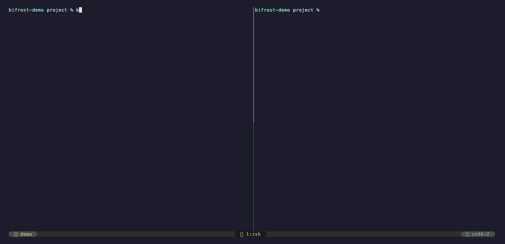
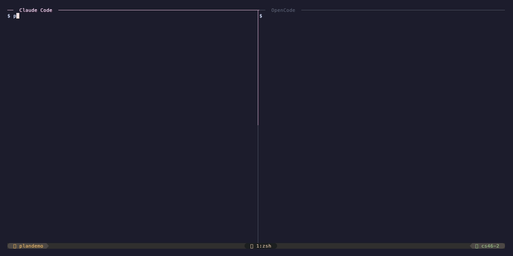

# Bifrost

[](https://github.com/kogungor/bifrost/actions/workflows/ci.yml)
[](https://goreportcard.com/report/github.com/kogungor/bifrost)
[](LICENSE)

> Local, trust-aware handoffs for AI coding agents.

Bifrost carries AI coding context across tools with evidence, freshness checks, plan verification, and secret-safe local state. Write `/handoff` in one tool, use `/handin --verify` in another, and continue with a briefing that tells the next agent what to trust, what to verify first, and what not to assume.



---

## The Problem

You're deep in a session with Claude Code. The context window or credit is nearly full. You have:

- A dozen architectural decisions that aren't in any file
- Three subtle bugs identified but not yet fixed
- A clear plan for the next few hours of work
- Environmental knowledge — which commands to run, which gotchas to avoid

The session ends. You open OpenCode — or start a fresh Claude Code session. You explain everything again from scratch.

But there's a subtler problem too. Even when you do carry context forward manually, the next AI has no signal for what to trust. It does not know which facts came from the repo, which claims came from the previous model, whether "tests pass" has evidence, whether active files changed after the handoff, or whether a plan step is only claimed done.

Bifrost solves both. It transfers session context and adds a local integrity layer around it: observed repo facts, evidence anchors, trust dimensions, stale-context checks, secret redaction, plan health, and a compact safe-next-action briefing.

## How It Works

```
Claude Code                                    OpenCode / new session
┌──────────────┐                              ┌──────────────────────┐
│              │                              │                      │
│ /handoff ────┼── .bifrost/session.md ─────▶│ /handin              │
│              │   .bifrost/session.json      │ /handin --verify     │
│              │   .bifrost/evidence/*        │                      │
│ /plan ───────┼── .bifrost/plans/*.json ───▶│ /review              │
│              │   .bifrost/*.plan.md         │ /plan <name> --next  │
└──────────────┘                              └──────────────────────┘

Local integrity layer:
  bifrost verify      stale branch/commit/file/evidence checks
  bifrost brief       compact mode-aware briefing
  bifrost diff        what changed since the previous snapshot
  bifrost timeline    local snapshot/verify/plan event history
  bifrost scrub       deterministic secret redaction
```

1. Type `/handoff` — the AI captures task, status, decisions, assumptions, risks, active files, and next step into `.bifrost/session.md` and canonical `.bifrost/session.json`.
2. Enrich or verify locally — Bifrost can collect git/file/project facts, attach evidence, check freshness, and redact secret-like values.
3. Switch tools and type `/handin --verify` — the next AI gets a compact briefing with "Trust this", "Verify this first", and "Do not assume this".
4. Continue working — with context, plan state, evidence, and calibrated trust instead of a blind summary.

## Built with Bifrost

This is the kind of briefing Bifrost produces for a new AI session after a verified handoff:

```
─────────────────────────────────────────
 Bifrost Briefing
─────────────────────────────────────────

Project    bifrost
Captured   18 minutes ago
Intent     implementing
Pressure   medium

Verification summary
  Status    warn
  Snapshot  current enough to inspect, but not blindly trust

Trust this
  - Branch and active file list match the snapshot.
  - `internal/snapshot/verify.go` exists and has current file metadata.
  - Plan `integrity-pack` is active; health 84/100.

Verify this first
  - `go test ./...` claim has no passing command evidence in the handoff.
  - `internal/cli/handin.md` changed after the snapshot.
  - One step is claimed done but not verified.

Do not assume this
  - Secret scrub has run on history.
  - The previous agent's "tests pass" claim is true without evidence.
  - The high severity risk "stale active files" is resolved.

Task
  Implement `bifrost verify` and `/handin --verify`.

Active files
  - internal/snapshot/verify.go
    trust: implementation=medium tests=low security=medium freshness=current evidence=observed
  - internal/cli/verify.go
    trust: implementation=medium tests=low security=medium freshness=stale evidence=weak

Next safest action
  Inspect `internal/cli/verify.go`, then run the targeted verify tests before coding.
─────────────────────────────────────────
```

The new session does not have to guess whether the previous summary was true. It gets the context plus the trust boundaries around that context.

---

## What Gets Captured

**Session state** — what you were doing:

| Category          | Example                                                                  |
| ----------------- | ------------------------------------------------------------------------ |
| Current task      | "Implement JWT refresh token rotation"                                   |
| Status            | `[x] validateToken()`, `[x?] refreshToken()`, `[ ] revokeToken()`         |
| Active files      | `src/auth.ts` — middleware stubbed, not wired                            |
| Decisions         | "Using jsonwebtoken not jose — already installed"                        |
| Environment notes | `AUTH_SECRET` must be in `.env`, not `.env.local`                        |
| Next step         | "Write unit tests for validateToken() using pattern from crypto.test.ts" |

**Trust signals** — what tells the next AI what to trust, what to verify first, and what mode to operate in:

| Category       | Example                                                                  |
| -------------- | ------------------------------------------------------------------------ |
| Session intent | `implementing` — plan, implement, debug, or review                       |
| Observed facts | branch, commit, dirty files, active file metadata, project commands       |
| Trust model    | `src/auth.ts` — implementation: medium, tests: low, freshness: current    |
| Evidence       | `npm test` claim backed by a recorded `command_result` or left unverified |
| Assumptions    | "Redis is available on localhost:6379" — unverified                      |
| Open questions | "Should refresh tokens be single-use or reusable across devices?"        |
| Risks          | "Token revocation list not yet implemented"                              |

Current Bifrost versions keep a human-readable `.bifrost/session.md` and can also maintain canonical `.bifrost/session.json` state for validation, verification, evidence anchors, trust dimensions, and diff/timeline operations.

What does **not** get captured: full file contents, conversation history, secrets, long command logs, or generated artifacts. The snapshot is a structured summary of working memory — things in the AI's context that aren't yet in any file.

## Installation

### Homebrew (macOS / Linux)

```bash
brew tap kogungor/bifrost
brew install --cask bifrost
```

### Shell One-Liner

```bash
curl -fsSL https://raw.githubusercontent.com/kogungor/bifrost/dev/install.sh | sh
```

### Manual (all platforms)

Download the binary for your platform from [GitHub Releases](https://github.com/kogungor/bifrost/releases), then:

```bash
chmod +x bifrost
sudo mv bifrost /usr/local/bin/
```

### Verify Installation

```bash
bifrost version
```

## Setup

### 1. Register Slash Commands

This installs `/handoff`, `/handin`, `/plan`, and `/review` for all detected AI tools:

```bash
bifrost install
```

To also register Bifrost as an MCP server (recommended — enables richer `/handin` briefings via structured tool calls):

```bash
bifrost install --mcp
```

Without `--mcp`, `/handin` falls back to reading `.bifrost/session.md` directly — it still works, but MCP gives it structured access to all fields.

To install for a specific tool only:

```bash
bifrost install --adapter claude-code
bifrost install --adapter opencode
```

To see what would happen without making changes:

```bash
bifrost install --dry-run
```

To overwrite existing command files (e.g., after an update):

```bash
bifrost install --force
```

### 2. Initialize a Project (optional)

```bash
cd ~/my-project
bifrost init
```

This creates:

- `.bifrost/` directory (gitignored automatically)
- `.bifrost/history/` for archived snapshots
- `BIFROST.md` — a project config file you can commit to git

`BIFROST.md` gives the incoming AI tool persistent project context (stack, conventions, important files, commands). It's optional — everything works without it.

### 3. Verify

```bash
bifrost doctor
```

A healthy output looks like:

```
  Bifrost Doctor

  ✓  Binary               0.1.0
  ✓  Claude Code          commands registered  (/path/to/commands)
  ✓  Claude Code          MCP server registered
  ✓  OpenCode             commands registered  (/path/to/commands)
  ✓  OpenCode             MCP server registered
  ✓  Project              BIFROST.md found
  ✓  Snapshot             22 minutes old
  ✓  Gitignore            .bifrost/ excluded

  All checks passed.
```

## Usage

### Handing Off

In your AI coding tool (Claude Code or OpenCode), type:

```
/handoff
```

The AI will capture the session state and write it to `.bifrost/session.md`. You'll see:

```
  Snapshot written to .bifrost/session.md
  JSON state written to .bifrost/session.json

  Task    Implement JWT refresh token rotation
  Files   3 active files captured
  Note    auth module half done, JWT middleware needs tests

  Switch to your target tool and run /handin
```

You can add a note:

```
/handoff auth module half done, pick up with the unit tests
```

### Handing In

In your target tool, type:

```
/handin
```

The AI reads the snapshot and presents a briefing:

```
  ─────────────────────────────────────────
   Bifrost Briefing
  ─────────────────────────────────────────

  Project    my-api
  From       claude-code
  Captured   22 minutes ago
  Commit     18270bac
  Intent     implementing
  Pressure   high (previous session was near context limit)
  Verify     warn — inspect changed files before trusting test claims

  Task
  Implement JWT refresh token rotation

  Status
  - [x] validateToken() — verified by `npm test -- auth`
  - [x?] refreshToken() — claimed done, not verified
  - [ ] revokeToken()

  Active files
  - src/auth.ts — implementation=medium tests=medium freshness=current
  - src/tokens.ts — implementation=medium tests=low freshness=stale

  Key decisions
  - Using jsonwebtoken not jose: already installed
  - Refresh tokens in Redis: faster lookup

  Environment notes
  - AUTH_SECRET must be in .env, not .env.local
  - Run with: npm run dev -- --port 3001

  Next step
  Write unit tests for validateToken() using pattern
  from crypto.test.ts. Focus on the expiry edge case.

  Assumptions (not verified)
  - Redis is available on localhost:6379
  - AUTH_SECRET is already set in .env

  Risks
  - Token revocation list not yet implemented

  Verify this first
  - src/tokens.ts changed after handoff
  - npm test status is unverified

  Do not assume
  - Redis is running locally
  - Refresh tokens are single-use
  ─────────────────────────────────────────

  Active plan   auth-refactor
  Status        active
  Health        72/100
  Progress      1 verified, 1 claimed but unverified, 1 blocked
  Next action   Verify claimed step step_003 before marking it done
  ─────────────────────────────────────────

  Open questions — address these before starting:
  - Should refresh tokens be single-use or reusable across devices?

  Ready to continue from here. Any adjustments before we start?
```

The AI waits for your confirmation before starting any work.

For higher-integrity resumes, use:

```
/handin --verify
```

The briefing starts with explicit trust guidance:

```text
Trust this.
- Branch and active file list are current.

Verify this first.
- Test-pass claims are unverified.
- src/tokens.ts changed after the handoff.

Do not assume this.
- Redis availability.
- Refresh token single-use behavior.
```

The same compact briefing is available from the CLI:

```bash
bifrost brief --mode implement --budget 5000
bifrost brief --mode review --full
bifrost brief --json
```

### Creating Plans

In any AI coding tool, type:

```
/plan auth-refactor
```

The AI creates a structured implementation plan and saves it to `.bifrost/auth-refactor.plan.md`:

```
  Plan written to .bifrost/auth-refactor.plan.md

  Title         Auth token refresh refactor
  Status        draft
  Plan version  v1
  Steps         5 steps defined (0% complete)
  Files         8 files referenced

  Ask another AI tool to run /review to get a critical analysis.
  Consensus required: reviewer must approve before work begins.
```

### Reviewing Plans

Switch to another AI tool and type:

```
/review auth-refactor
```

The reviewer AI analyzes the plan critically (edge cases, security, architecture, missing steps) and submits an explicit outcome:

- **Approved** — plan activates immediately, consensus reached, work can begin
- **Needs revision** — feedback recorded, plan returned to planner

```
  Review complete for .bifrost/auth-refactor.plan.md

  Outcome       needs_revision
  Plan version  v1
  Revision      0 of 3

  Key findings:
  - Token revocation not addressed
  - No rollback strategy for failed migrations

  Planner should run /plan auth-refactor --revise to address feedback.
```

The planner addresses the feedback and re-submits:

```
/plan auth-refactor --revise
```

The reviewer approves in the next round:

```
  Outcome       approved
  Consensus     reached

  Plan is now active. Work can begin.
```



If the review cycle stalls after the maximum number of revisions (default: 3), the planner can override:

```
/plan auth-refactor --force-accept
```

You can also review arbitrary files:

```
/review docs/rfc-auth.md
```

Plans support a full lifecycle: `draft` → `active` → `completed` → `archived`.

### Snapshot Freshness

`/handin` always shows the snapshot age. If it's older than 2 hours, a warning is shown. If older than 24 hours, a prominent warning appears. You're never blocked — just informed.

Run a local integrity check before trusting a handoff:

```bash
bifrost verify
bifrost verify --strict
bifrost verify --json
```

`bifrost verify` checks snapshot age, branch and commit drift, active file existence and metadata, evidence-backed claims, unresolved high severity risks/questions, active plan state, and secret-like values in local Bifrost state. It never runs destructive commands.

### JSON State, Validation, And Migration

Legacy Markdown snapshots remain readable. Canonical JSON state enables validation and machine-readable workflows:

```bash
bifrost migrate --dry-run
bifrost migrate
bifrost validate
bifrost validate --snapshot .bifrost/session.json
bifrost validate --plan .bifrost/plans/auth-refactor.json
bifrost render --snapshot .bifrost/session.json
```

Validation errors are actionable and use this shape:

```text
Error: invalid snapshot schema
- field: interpretation.status_items[0].state
- value: done
- expected: not_started | in_progress | blocked | claimed_done | verified_done | invalidated

Try:
  bifrost migrate --dry-run
```

### Diff And Timeline

Bifrost can show what changed between the latest archived snapshot and the current snapshot:

```bash
bifrost diff
bifrost diff latest~1..latest
bifrost diff --json
bifrost timeline
bifrost restore 2 --preview
```

Timeline events are local JSON Lines in `.bifrost/timeline.jsonl`. They only store compact metadata such as event type, snapshot ID, plan name, status, and task summary. Secret-like values are redacted before writing.

### Working with BIFROST.md

If `BIFROST.md` exists in your project root, `/handin` loads it and includes project context (stack, conventions, commands) in the briefing. This gives every new session a baseline understanding of the project.

You can analyze and promote durable project context from local facts and snapshots:

```bash
bifrost context check
bifrost context update --dry-run
bifrost context update --accept all
bifrost promote decision --dry-run
bifrost promote --accept prom_1234abcd
```

Promotion is explicit: Bifrost does not overwrite durable project context without an accepted candidate ID or `--accept all`.

Example `BIFROST.md`:

```markdown
---
project: my-api
---

# Project: my-api

## What this is

REST API for the mobile app. Currently in beta.

## Stack

- Node.js 20, Express, PostgreSQL, Redis
- TypeScript, Jest for testing

## Conventions

- All new endpoints need integration tests
- Use zod for request validation
- Error responses follow RFC 7807

## Commands

- `npm run dev` — development server (port 3001)
- `npm test` — full test suite
- `npm run db:migrate` — run pending migrations

## Do not touch

- `src/generated/` — auto-generated from OpenAPI spec
```

## CLI Reference

| Command                               | Description                                      |
| ------------------------------------- | ------------------------------------------------ |
| `bifrost install`                     | Register slash commands for detected AI tools    |
| `bifrost install --mcp`               | Also register Bifrost as an MCP server           |
| `bifrost init`                        | Initialize Bifrost in the current project        |
| `bifrost status`                      | Show snapshot age, size, intent, and active plan |
| `bifrost export`                      | Export snapshot and/or plans as JSON to stdout   |
| `bifrost validate`                    | Validate snapshot and plan state                 |
| `bifrost migrate --dry-run`           | Preview Markdown-to-JSON migration               |
| `bifrost render`                      | Render JSON v2 state back to Markdown            |
| `bifrost snapshot --enrich`           | Collect observed git/file/project facts          |
| `bifrost evidence list`               | List evidence records                            |
| `bifrost evidence show <id>`          | Show one evidence record                         |
| `bifrost verify`                      | Check freshness, evidence, risks, files, secrets |
| `bifrost brief --mode implement`      | Print compact mode-aware briefing                |
| `bifrost scrub --check`               | Check local Bifrost state for secret-like values |
| `bifrost scrub --write --history`     | Redact secret-like values in local Bifrost state |
| `bifrost plan status <name>`          | Show plan health and step status                 |
| `bifrost plan next <name>`            | Show safest next plan action                     |
| `bifrost plan verify <name>`          | Run configured plan verification commands        |
| `bifrost context check`               | Analyze durable `BIFROST.md` context             |
| `bifrost context update --dry-run`    | Preview `BIFROST.md` promotion patch             |
| `bifrost promote --accept <id|all>`   | Promote accepted durable context candidates      |
| `bifrost diff`                        | Compare latest archived and current snapshot     |
| `bifrost timeline`                    | Show local snapshot/verify/plan event timeline   |
| `bifrost history`                     | List archived snapshots                          |
| `bifrost restore <n>`                 | Restore a historical snapshot                    |
| `bifrost restore <n> --preview`       | Preview restore without modifying files          |
| `bifrost doctor`                      | Diagnose installation and configuration          |
| `bifrost doctor --security`           | Check local Bifrost state for secret-like values |
| `bifrost doctor --fix`                | Diagnose and automatically fix detected issues   |
| `bifrost update`                      | Show update instructions for the latest release  |
| `bifrost update --check`              | Check if a newer version is available            |
| `bifrost version`                     | Print version                                    |
| `bifrost completion <shell>`          | Generate shell completions (bash, zsh, fish)     |

### Global Flags

| Flag               | Description                          |
| ------------------ | ------------------------------------ |
| `--no-color`       | Disable color output                 |
| `--quiet`          | Print only errors                    |
| `--project <path>` | Override project root auto-detection |

### Exporting State

Export the current snapshot and/or plans as JSON — useful for CI pipelines and scripts:

```bash
bifrost export                    # snapshot JSON (default)
bifrost export --format plans     # all plans as JSON
bifrost export --format all       # snapshot + plans
```

### Snapshot History

Every `/handoff` automatically archives the previous snapshot. History is capped at 50 entries — oldest snapshots are pruned automatically. JSON-backed snapshots are archived too. View, diff, preview, and restore them:

```bash
bifrost history

  Snapshot history — my-api

  #  Timestamp              Age          Source         Task
  ─  ─────────────────────  ───────────  ─────────────  ──────────────────────
  1  2025-03-21 14:32:17    22 min ago   claude-code    auth module half done
  2  2025-03-21 11:18:44    3 hr ago     opencode       database schema finalized
  3  2025-03-20 19:05:31    yesterday    claude-code    initial project setup

bifrost restore 2
bifrost restore 2 --preview
bifrost diff
```

## Supported Tools

| Tool        | Status    |
| ----------- | --------- |
| Claude Code | Supported |
| OpenCode    | Supported |
| Cursor      | Planned   |
| Gemini CLI  | Planned   |
| Codex       | Planned   |

Adding a new tool requires only a new adapter file — no changes to core logic.

## Files

| Path                                | Purpose                                  | In Git? |
| ----------------------------------- | ---------------------------------------- | ------- |
| `BIFROST.md`                        | Durable project context                  | Yes     |
| `.bifrost/session.md`               | Human-readable active snapshot           | No      |
| `.bifrost/session.json`             | Canonical JSON v2 active snapshot        | No      |
| `.bifrost/handoff.md`               | Freeform handoff note                    | No      |
| `.bifrost/history/`                 | Archived Markdown and JSON snapshots     | No      |
| `.bifrost/evidence/`                | Optional structured evidence records     | No      |
| `.bifrost/plans/<name>.json`        | Canonical JSON v2 plans                  | No      |
| `.bifrost/<name>.plan.md`           | Human-readable implementation plans      | No      |
| `.bifrost/timeline.jsonl`           | Local snapshot/verify/plan event history | No      |
| `.bifrost/config.json`              | Optional local Bifrost runtime config    | No      |

`.bifrost/` is automatically added to `.gitignore`.

## MCP Server

Bifrost can run as an [MCP](https://modelcontextprotocol.io/) server, exposing snapshot and plan operations as formal tool calls over stdio JSON-RPC. AI tools that support MCP can call these tools directly — no slash commands needed.

Register it:

```bash
bifrost install --mcp
```

This writes config to each adapter's MCP config path (e.g. `~/.claude/mcp.json`). The server runs as a subprocess — no network sockets, no background daemon.

### Snapshot Tools

| Tool                     | Description                                                                                                                                         |
| ------------------------ | --------------------------------------------------------------------------------------------------------------------------------------------------- |
| `bifrost_read_snapshot`  | Read the current session snapshot, including legacy Markdown fields and v2 JSON integrity state when available                                      |
| `bifrost_write_snapshot` | Write a new snapshot with semantic fields, legacy confidence, optional command/manual evidence, collected git facts, and canonical `session.json`    |
| `bifrost_write_note`     | Write a freeform handoff note                                                                                                                       |
| `bifrost_status`         | Quick status: snapshot age, session intent, active plan, open question count, history count                                                         |

### Plan Tools

| Tool                  | Description                                                        |
| --------------------- | ------------------------------------------------------------------ |
| `bifrost_read_plan`   | Read a named plan (default: "plan")                                |
| `bifrost_write_plan`  | Create a new plan with title, goal, steps, and constraints         |
| `bifrost_update_plan` | Add review notes, update step statuses/content, change plan status |
| `bifrost_delete_plan` | Delete a named plan                                                |
| `bifrost_list_plans`  | List all plans with name, status, title, and completion %          |

## What Bifrost Is Not

- A cloud memory service or automatic long-term memory
- A build output bridge
- A model router or proxy
- A replacement for CLAUDE.md or AGENTS.md

Bifrost is a local point-in-time context integrity layer and cross-tool planning workflow with a simple slash command UX.

## Contributing

Contributions welcome. See [CONTRIBUTING.md](CONTRIBUTING.md) for setup, project structure, and how to add new adapters or slash commands.

**Known gaps for contributors:**

- `internal/cli` test coverage is ~5% — the integration tests run against a compiled binary so Go's coverage tool cannot instrument them. Fixing this requires building with `go build -cover` and setting `GOCOVERDIR` in the test harness.
- **Cursor adapter** — most-requested missing adapter. Needs research into Cursor's slash command format and MCP config path before implementation.

## Security

- All data stays local. No network calls after installation.
- No telemetry or analytics.
- Secret-like values are detected deterministically before snapshot writes and can be scrubbed with `bifrost scrub`.
- `.bifrost/` is gitignored by default.
- The snapshot remains inspectable as plain Markdown, with JSON state available for validation and automation.

## Integrity Metrics

These are manual product-health checks you can track while using Bifrost:

| Metric | How to check |
| ------ | ------------ |
| Resume time | Time from `/handin` to a safe next action; target under 2 minutes |
| Critical unverified claim rate | Count high-risk claims without evidence in `bifrost verify --json` |
| Stale active file detection | Confirm `bifrost verify` catches branch, commit, or active file drift |
| Secret leakage corpus result | Run `go test ./internal/security` and `bifrost scrub --check --history` |
| Plan claimed vs verified coverage | Inspect `bifrost plan status <name>` |
| Default briefing size | Run `bifrost brief --mode implement --budget 5000` |

## License

MIT
